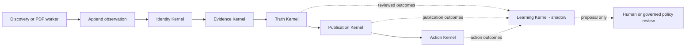

# CategoryVantage Governed Kernel Architecture

CategoryVantage turns noisy public market observations into evidence-backed
decision support. Its architecture coordinates identity, evidence,
authoritative state, publication, and permission to act while preserving a
complete event and audit history for each product.

This design uses a shared Kernel Constitution and six logical kernels. The
repository connects runnable Evidence and Action components with the ownership
contracts for Identity, Truth, Publication, and Learning.

## Design goals

- Keep observations separate from authoritative state.
- Prevent semantic similarity from becoming identity or evidence approval.
- Give each governed field one authoritative writer.
- Require customer-visible output to reference a known truth version.
- Recheck evidence and permission immediately before an action.
- Keep learning outputs advisory until they pass explicit review and adoption.
- Preserve reason codes, provenance, policy version, and replayable audit state.

## Kernel Constitution

Every kernel follows the same machine-enforceable rules:

1. Every authoritative field has exactly one writer.
2. Observations are append-only; corrections are linked events.
3. Identity is evaluated before evidence is attached to an entity.
4. Evidence must be sufficient, current, and valid for the intended decision.
5. `unknown`, `false`, `unavailable`, `blocked`, and `access_error` are distinct.
6. An older valid observation may remain history but cannot silently become
   current state.
7. Published output references an authoritative `truth_version`.
8. A customer snapshot cannot invent or lead authoritative state.
9. Every transition records its actor, cause, timestamp, policy version,
   evidence references, reason codes, and audit reference.
10. Stale or concurrent writes fail closed.
11. Learning output is a proposal, never a direct production mutation.
12. Failed gates produce explicit review, revalidation, withdrawal, or block
    outcomes instead of disappearing.

## Logical kernels and authority

| Kernel | Owns | Produces | Integration contract |
| --- | --- | --- | --- |
| Identity | canonical entity and same-product decisions | confirmed, uncertain, conflict, split/review | supplies entity state to Evidence and Truth |
| Evidence | validity, sufficiency, provenance, freshness | qualified evidence, rejected evidence, reason codes | consumes confirmed identity and supplies qualified evidence |
| Truth | authoritative domain state and version lineage | new truth versions, unknown, confirmed, superseded | owns versioned domain state |
| Publication | customer projection and publish eligibility | in-sync, lagging-but-valid, held, withdrawn | projects a resolvable truth version |
| Action | permissioned operational next steps | recheck, hold, review, publish request, suppress request | revalidates current evidence and permission |
| Learning | reviewed outcomes and policy proposals | proposal, evidence references, expected impact | routes proposals through governed policy review |

The implementation target is a modular monolith with explicit ownership
contracts, shared event envelopes, and versioned kernel interactions. The same
contracts can later support independent services without changing decision
semantics.

## Independent state axes

A single global status cannot represent the system safely. CategoryVantage
models at least eight axes independently:

| Axis | Example states |
| --- | --- |
| Identity | `confirmed`, `uncertain`, `conflict` |
| Observation | `success`, `access_error`, `not_found` |
| Evidence | `valid`, `insufficient`, `conflicting` |
| Freshness | `current`, `aging`, `expired` |
| Control | `open`, `blocked`, `revalidation_required` |
| Authoritative truth | `confirmed`, `unknown`, `superseded` |
| Publication | `in_sync`, `lagging_but_valid`, `held`, `withdrawn` |
| Action permission | `allowed`, `held`, `manual_review`, `recheck` |

Policy version, time and concurrency, authorization, provenance, audit, and
rollback are cross-cutting controls.

## System flow



The flow is intentionally asymmetric. Learning can observe governed outcomes
and propose a change, but it has no direct write path back to identity, truth,
publication, or action permission.

## Worked example: product page access error

Assume a TV identity was previously confirmed and the last verified price was
`2499`. A newer product-page request returns an access error.

```text
identity_state          = confirmed
observation_state       = access_error
evidence_state          = insufficient
freshness_state         = expired
control_state           = revalidation_required
authoritative_price     = unknown
last_verified_price     = 2499  # retained as history
publication_state       = withdrawn
next_action             = pdp_recheck
```

The access error supports one conclusion: the page could not be observed. It
does not prove a current price, continued availability, or out-of-stock state.
The old price remains useful history without being presented as current truth.

## Event envelope

Kernel events use a common envelope so decisions can be traced and replayed:

```text
event_id
event_type
entity_id
observation_id
causation_id
correlation_id
occurred_at
recorded_at
actor_type
actor_id
source_system
policy_version
expected_state_version
resulting_state_version
reason_codes
evidence_references
audit_reference
```

The envelope stores references instead of copying sensitive payloads when a
minimal identifier is sufficient.

## Mapping to this repository

| Architecture responsibility | Public reference implementation |
| --- | --- |
| Evidence qualification | [`latentatlas/evidence_guard.py`](../latentatlas/evidence_guard.py) |
| Evidence intake schema | [`latentatlas/schema_validator.py`](../latentatlas/schema_validator.py) |
| Local candidate index | [`latentatlas/evidence_index.py`](../latentatlas/evidence_index.py) |
| End-to-end evidence gates | [`latentatlas/evidence_vector_layer.py`](../latentatlas/evidence_vector_layer.py) |
| Action authority lease checks | [`latentatlas/action_time_revalidation.py`](../latentatlas/action_time_revalidation.py) |
| Synthetic evidence cases | [`examples/sample_decisions.jsonl`](../examples/sample_decisions.jsonl) |
| Synthetic action cases | [`examples/action_packets.jsonl`](../examples/action_packets.jsonl) |

These components provide executable examples for evidence qualification and
action-time revalidation. The full design extends them with Identity, Truth,
Publication, and Learning ownership contracts plus migration and downstream
consistency tests.

## Failure-oriented acceptance tests

An implementation should demonstrate that:

- an identity conflict cannot be promoted by a high similarity score;
- a stale observation cannot silently refresh authoritative state;
- an access error cannot become an availability or price fact;
- a customer projection cannot exist without a resolvable truth version;
- an expired lease or changed permission blocks the action;
- a live action cannot be authorized by the dry-run reference layer;
- a learning proposal cannot reach a production mutation path;
- deterministic replay reaches the same governed state;
- failed gates remain visible in audit output.

## Related work

- [CategoryVantage](https://categoryvantage.com/)
- [Relevance Is Not Authority](https://doi.org/10.5281/zenodo.20161629)
- [Evidence Authority After Retrieval](https://doi.org/10.5281/zenodo.21243387)
- [Authority Leases and Concurrent Evidence Failure](https://doi.org/10.5281/zenodo.21432540)
