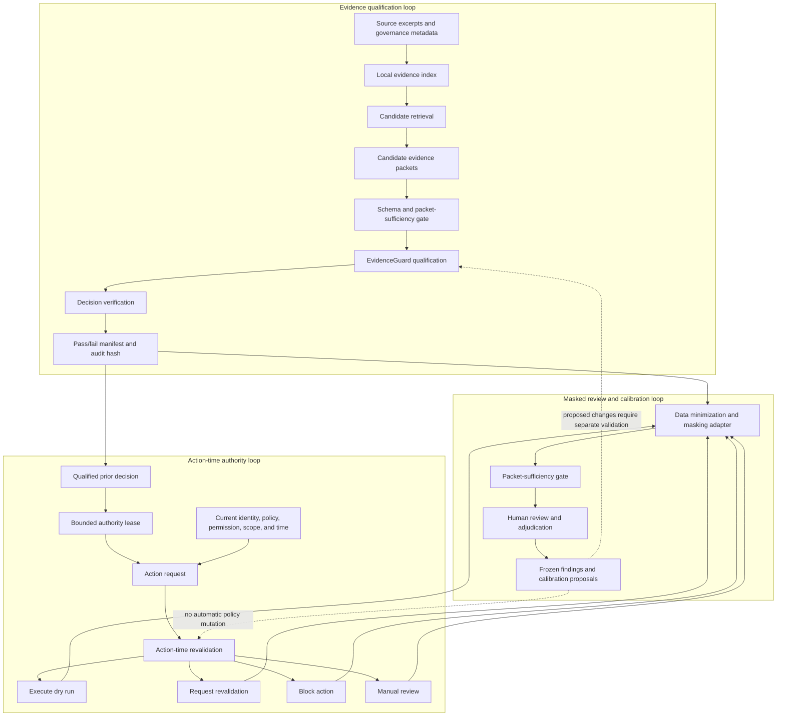

# LatentAtlas Evidence and Action Architecture

## Overview

LatentAtlas is a reference architecture for evaluating a specific class of
failures in LLM and agentic systems: a system can retrieve related information
and still lack enough evidence or authority to make a decision or take an
action.

The architecture separates three questions that are often collapsed into one:

1. **Evidence qualification:** Is the available evidence current,
   authoritative, identity-matched, and sufficient for the proposed decision?
2. **Action-time authority:** Does that evidence still authorize this actor to
   take this action, with this scope and impact, now?
3. **Review and calibration:** Can the behavior be evaluated from minimized,
   masked packets without exposing raw customer or tenant data?

The public package contains runnable deterministic implementations for the
first two loops and a documented review contract for the third.

## Why the Architecture Matters

Semantic similarity answers whether two pieces of information are related. It
does not establish that the information is true, current, authoritative,
specific to the same entity, or sufficient for a decision.

Evidence support also does not grant permission to act. A permission can
expire, an entity can change, the policy can be updated, the action scope can
expand, or the expected impact can become more consequential after the
evidence was qualified.

LatentAtlas therefore treats retrieval, evidence qualification, decision
support, action authorization, and publication as separate control surfaces.

## Architecture

## 1. Evidence Qualification Loop

### Input contract

Each source excerpt carries identity and governance metadata alongside its
text. The local index preserves that metadata when producing candidates. A
candidate is not promoted merely because its text is close to the query.

The qualification layer evaluates dimensions such as:

- source authority and source type;
- entity and product identity consistency;
- freshness and validity window;
- direct support for the requested decision;
- contradictions or unresolved ambiguity;
- minimum packet completeness.

### Decision contract

A decision object keeps retrieval and qualification results distinct. Its
inspectable fields include:

- `semantic_similarity`
- `evidence_verdict`
- `identity_verdict`
- `recommended_action`
- `confidence`
- `reason_codes`
- selected and rejected evidence identifiers
- `audit.input_hash`

The audit hash makes the evaluated input reproducible and connects each verdict
to the evidence and qualification result that produced it.

### Terminal evidence states

| Verdict | Meaning |
| --- | --- |
| `confirmed_evidence` | The packet satisfies the configured evidence and identity gates. |
| `related_not_enough` | The material is relevant but does not support the requested decision. |
| `contradictory` | Material evidence conflicts and cannot be silently resolved. |
| `needs_context` | Required context is missing. |
| `needs_review` | A bounded human decision is required. |
| `quarantine_false_neighbor` | A semantically close candidate failed identity or evidence qualification. |

Missing information is an explicit outcome. The system does not convert
uncertainty into a convenient positive result.

## 2. Action-Time Authority Loop

### Authority lease

A qualified decision is not an unlimited authorization. LatentAtlas represents
action authority as a bounded lease that ties together:

- actor;
- proposed action;
- target and scope;
- evidence identifiers;
- identity state;
- permission state;
- policy version;
- validity window;
- action impact.

Immediately before execution, the revalidation layer compares the lease with
the current state. A mismatch is surfaced rather than hidden by the earlier
decision.

### Action routing contract

The layer keeps its execution verdict separate from its recommended action.

| Execution verdict | Recommended action | Use |
| --- | --- | --- |
| `action_authorized` | `execute_dry_run` | The lease remains valid for a non-mutating reference action. |
| `revalidation_required`, expired authority, or recoverable drift | `request_revalidation` | Evidence or authority may be recoverable but must be refreshed. |
| A hard scope, actor, permission, identity, impact, or live-execution block | `block_action` | The request cannot proceed under the current lease. |
| `needs_review` | `manual_review` | The case requires bounded human judgment. |

The public implementation produces dry-run decisions and machine-readable
routing. `execute_dry_run` records that the packet passed action-time
revalidation.

### Inspectable action output

The action-time layer returns:

- `execution_verdict`
- `recommended_action`
- `followup_lane`
- `action_impact`
- `risk_assessment`
- `risk_exposure`
- `reason_codes`
- bound evidence identifiers and an audit hash

Risk fields are deterministic prioritization aids. They are not empirical
probabilities and do not replace the underlying reason codes.

## 3. Masked Review and Calibration Loop

The review layer is designed around data minimization. A useful evaluation
packet should describe the decision conditions and observed outcome without
copying the underlying customer or tenant content.

The masked packet schema excludes:

- raw customer or source text;
- source URLs, product titles, sellers, or prices;
- personal data or tenant payloads;
- prompts, model transcripts, credentials, or access tokens.

Masked packets retain the minimum fields needed to test the decision,
including the relevant verdict, reason codes, lease state, action class,
expected behavior, and observed or adjudicated outcome.

A packet-sufficiency gate runs before review. Insufficient packets are not
counted as confirmed failures or successes. Human review and adjudication are
kept separate from automated qualification, and any calibration change remains
a proposal until it passes its own validation.

## Frozen Masked-Review Result

The current public research report records a frozen, masked review of 151
high-priority evaluation packets. Of these, 146 were outcome-ready:

- 99 packet-supported blocks;
- 22 packet-unsupported or false blocks;
- 25 insufficient-evidence outcomes.

These counts describe the frozen evaluation sample and make both missed
evidence and over-blocking observable under one review contract.

## Code-to-Architecture Map

| Architecture responsibility | Public implementation |
| --- | --- |
| Evidence and identity qualification | [`latentatlas/evidence_guard.py`](../latentatlas/evidence_guard.py) |
| Local candidate index with retained metadata | [`latentatlas/evidence_index.py`](../latentatlas/evidence_index.py) |
| End-to-end evidence pipeline | [`latentatlas/evidence_vector_layer.py`](../latentatlas/evidence_vector_layer.py) |
| Packet schema gate | [`latentatlas/schema_validator.py`](../latentatlas/schema_validator.py) |
| Decision and manifest verification | [`latentatlas/verify_outputs.py`](../latentatlas/verify_outputs.py) |
| Authority-lease revalidation | [`latentatlas/action_time_revalidation.py`](../latentatlas/action_time_revalidation.py) |
| Reproducible command-line entry points | [`latentatlas/cli.py`](../latentatlas/cli.py) |
| Synthetic evidence and action packets | [`examples/`](../examples/) |
| Failure-oriented executable checks | [`tests/`](../tests/) |

The masking adapter and human adjudication process are architecture contracts
for data-minimized evaluation packets.

## Invariants and Failure Tests

The architecture makes the following conditions testable:

1. High semantic similarity cannot override a failed identity check.
2. A related excerpt cannot become `confirmed_evidence` without the required
   authority, freshness, and support.
3. Contradictory or incomplete packets cannot silently pass.
4. Retrieval cannot write canonical truth.
5. A previously valid decision cannot authorize an action after its lease
   expires or its permission, identity, policy, scope, or impact changes.
6. Revalidation cannot execute an external tool or mutate production state.
7. Insufficient masked packets cannot enter outcome-ready counts.
8. Review findings cannot automatically rewrite evidence or action policy.
9. Every terminal result exposes reason codes and a reproducible audit surface.

## Research Context

- [Relevance Is Not Authority](https://doi.org/10.5281/zenodo.20161629)
- [Evidence Authority After Retrieval](https://doi.org/10.5281/zenodo.21243387)
- [Authority Leases and Concurrent Evidence Failure in Safe Agentic Execution](https://doi.org/10.5281/zenodo.21432540)
- [Frozen masked-review findings](https://latentatlas.ai/authority-leases/)

## Implementation profile

This repository packages the deterministic evaluation layer, synthetic packet
sets, CLI workflows, tests, and architecture documents used to reproduce the
evidence and action-time authority results.
