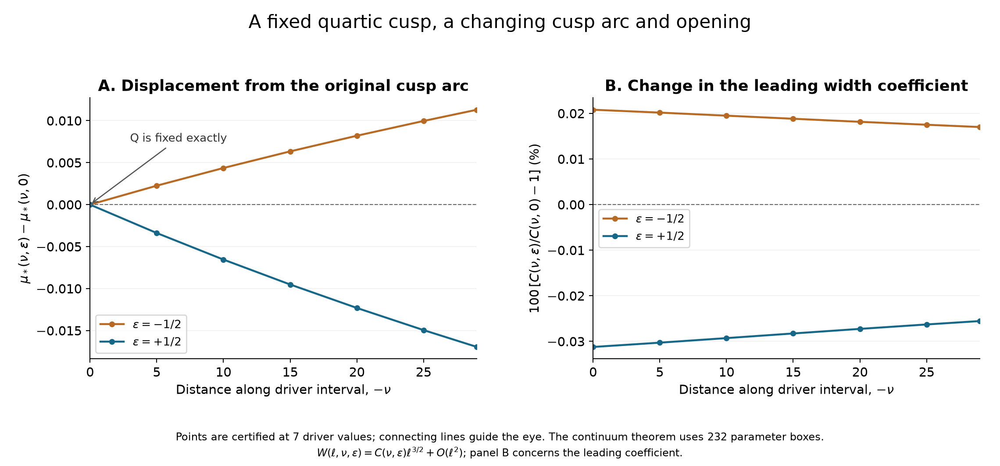
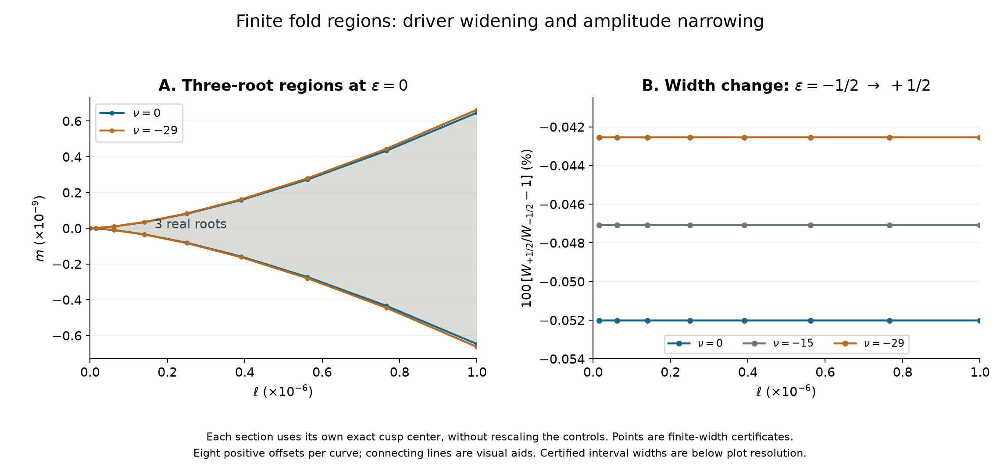

# R08 — Cusp yerinde kalırken çevresindeki kök bölgesi değişiyor

20 Eylül 2026. Durum: belirtilen aile ve yerel kapsam için analitik
türetim ve hesap destekli doğrulama tamamlandı. Dış matematiksel
inceleme ve literatürde öncelik değerlendirmesi açık.

Bu turda R07'nin bıraktığı soruyu cevapladık: **Q cusp'ını tam yerinde
tutan seçilmiş çekirdek değişimi, bütün cusp yayını ve iki foldun
arasındaki üç gerçek köklü bölgeyi nasıl değiştiriyor?**

Sonuç şu: Q aynı tam noktada kalıyor; ondan çıkan cusp yayı değişiyor.
Her kesiti kendi cusp merkezine taşıdığımızda, aynı sonlu kök
penceresinde iki ayrı düzenli hareket var. ν azaldıkça üç köklü
bölge genişliyor. Çekirdek değişiminin genliği ε arttıkça daralıyor.
İkisi de yalnız genişlik karşılaştırması değil: üst ve alt sınırın
ayrı ayrı doğru yöne gittiği gösterildi.

## Ne yaptık?

Çekirdeği Φε(u)=Φ(u)[1+εh₀(u)] biçiminde değiştirdik.
h₀, R07'de tam moment kofaktörleriyle tanımlanan dört kosinüsün
aynı sabit bileşimi. Katsayıları yuvarlayarak yeniden tanımlamadık.
‖h₀‖∞=1 ve −1/2≤ε≤1/2 olduğundan çekirdek pozitif kalıyor.
Q'da üç momentin tam sıfır olması, Q'nun bütün bu genliklerde tam
aynı cusp olarak kalmasını sağlıyor.

R07 yalnız büyük genlik altında Q'nun korunmasını göstermişti.
R08 bunu **−29≤ν≤0 yayının tamamına, genlik aralığının tamamına
ve aynı sonlu fold penceresine** taşıyor. Her ε için μ=0 kesitini
tam bir kez geçen, kayıtlı tüpler içinde tek bir cusp yayı var.
Bu, tüm integralin bütün cusp'larının tek olduğu iddiası değil.

Kullandığımız koordinatlar her kesitin kendi tam cusp'ına göre
s=t−t*, ℓ=λ−λ*, m=μ−μ*. Birimleri değiştirmiyoruz.
Ortak pencere |s|≤0.003, |ℓ|≤10^-6, |m|≤2×10^-9.
0<ℓ≤10^-6 için iki fold arasında tam üç basit gerçek kök;
diskriminantın dışında bu pencerede tam bir basit gerçek kök var.
Fold üzerinde çift ve basit kök, cusp'ta üçlü kök bulunuyor.

## Yeni nicel sonuç

Üst ve alt foldun arasındaki genişliği W ile gösterelim.
Bütün belirtilen parametre bölgesinde:

\[
0.0003\,\ell^{3/2}<-\partial_\nu W<0.003\,\ell^{3/2},
\qquad
0.0002\,\ell^{3/2}<-\partial_\epsilon W<0.005\,\ell^{3/2}.
\]

Her iki parametre artışında da üst fold aşağı, alt fold yukarı
gidiyor. Bu nedenle üç köklü şeritler, **kendi merkezlerine
taşındıktan sonra**, iç içe daralıyor. ν'yu azaltınca yön tersine
dönüyor ve şerit genişliyor.

Değişimin büyüklüğü bu seçilmiş yön için küçük. ε'yi −1/2'den
+1/2'ye götürdüğümüzde, ℓ=10^-6 kesitindeki gerçek sonlu genişliğin
daralması aşağıdaki aralıklarda:

| Yay üzerindeki kesit | Sonlu W genişliğinde daralma, yüzde |
|---|---|
| ν=0, tam yerinde tutulan Q | [0.05201560, 0.05201561] |
| ν=−15 | [0.04707661, 0.04707662] |
| ν=−29 | [0.04254130, 0.04254131] |

Bu tablo başterimden tahmin edilmedi; fold konumlarına ait ayrı
kök sertifikalarından üretildi. Örneğin Q'da başterim katsayısı C'nin
değişimi yaklaşık −%0.0520157033; sonlu genişlik değişimi ona çok yakın
ama aynı sayı değil. Yüzdelerin dışa yuvarlanmış kaynakları
[key_results.json](results/key_results.json) dosyasında.

Q'daki konum değişimi tam sıfır. Buna karşılık ν=−29'da μ cusp
koordinatının eski ε=0 yayına göre kayması ε=−1/2 için yaklaşık
+0.0113027546, ε=+1/2 için yaklaşık −0.0169544780. Bu yüzden
“cusp'ı yerinde tutan yön” bütün yaydaki her cusp'ı yerinde tutuyor
anlamına gelmiyor.

## Bilimsel anlamı

Artık yalnız bir cusp'ın varlığı veya yakınında bilinen cusp şeklinin
görülmesiyle yetinmiyoruz. Bu özel integralde, bir cusp'ı tam sabit
tutarak çevresindeki kök geometrisini değiştiren bir aile kurduk ve
bu değişimin yönünü bütün bir cusp yayı boyunca kontrol ettik.
**Cusp konumu ile cusp çevresindeki kök bölgesinin açıklığı,
birbirinden ayrılabilen nicelikler.**

Genel moment-nullspace fikri tek başına yeni bir yöntem iddiası
taşımıyor. Bu aileye özgü katkı adayı; tam Q kenarı, bağlantısı
doğrulanmış iki parametreli cusp yüzeyi, ortak sonlu kök penceresi
ve iki yönde sıkı fold iç içeliğinin birlikte gösterilmesi.
Bu, makalenin ana hikâyesine “konum korunurken geometrinin nasıl
değiştiği” sorusunu ekliyor. R06'nın yakın literatür karşılaştırmasını
bu yeni sonuçla güncellemek ve alan uzmanının değerlendirmesini
almak gerekiyor. Dergi kabulü veya bir akademik unvana eşdeğerlik
çıkarımı yapılmıyor.

Etkinin küçük olması saklanacak bir durum değil: burada gösterilen
kontrollü değişim yaklaşık %0.04–0.05 ölçeğinde. Daha büyük geometrik
değişimlerin mümkün olup olmadığı ayrı bir araştırma sorusu.
Mevcut sonuç “büyük faz geçişi” veya fiziksel kararlılık olarak sunulmuyor.

## Nasıl kontrol ettik?

- 58 ν hücresi ve dört yardımcı genlik aralığıyla 232 parametre
  kutusu doğrulandı. 228 ν bağlantısı ve 174 genlik bağlantısı,
  aynı çözümün izlendiğini teklikle ilişkilendiriyor.
- 4002 yeni rigoröz H momenti, önceki F momentleri ve mutlak
  üst sınırlarıyla birlikte kullanıldı.
- Ayrı rasyonel program bütün 232 kutuda daralma eşitsizliklerini,
  402 bağlantıyı, sonlu kök geometrisi koşullarını ve iki taşıma
  hesabını denetledi. Beşinci türevleri farklı bir fold ODE hesabıyla
  elde etti. Yeni genlik polinomlarının eski ν polinomlarına
  indirgenmesi iki tam rasyonel polinom özdeşliğiyle kontrol edildi.
- 21 moment farklı bir frekans kaydırma integraliyle; dokuz moment
  ayrıca mpmath ile iki hassasiyette karşılaştırıldı.
- Nicel tablo ve şekiller için 21 dar cusp kutusu, 144 sonlu fold
  kutusu ve bunların ayrı rasyonel denetimi tamamlandı.

Denetimlerin bağımsızlık sınırı açık: ayrı rasyonel program, kayıtlı
integral kapsamalarını ve yeni iki değişkenli Taylor/polinom
aralıklarını girdi kabul ediyor. O aşamanın tamamını ikinci bir
uygulamayla yeniden üretmiyor. Bu nedenle “birbirinden tamamen
bağımsız iki ispat” veya biçimsel ispat asistanı doğrulaması demiyoruz.
[Ayrıntılı kanıt ve güven sınırı](PROOF.md).

İlk geniş genlik kutuları bazı yeter hata sınırlarını geçemedi.
Genlik aralığını dört parçaya bölmek, aynı matematiksel iddiayı daha
dar kapsamalarla doğrulamayı sağladı. Başarısız denemeler korunuyor;
bunlar matematiksel karşıörnek sayılmadı.
[Tanı kaydı](DIAGNOSTICS.md).

## Şekiller ve sonraki soru

Şekiller makaleye uygundur: eksenler, karşılaştırılan parametreler,
merkezleme ve başterim/sonlu genişlik ayrımı açık. Noktalar
sertifikalı; aralarındaki çizgiler görsel kılavuz. PNG ve ölçeklenebilir
SVG sürümleri hazır. İngilizce [teorem eki](THEOREM_APPENDIX.tex)
bu sonucu makale taslağına aktarılabilir biçimde içeriyor; özgün
makale henüz yeniden yazılmadı.

Bir sonraki araştırma sorusu artık daha seçici olabilir:
**Q'yu tam sabit tutan pozitif çekirdekler içinde, açıklık değişimini
hangi moment bileşimleri büyütür ve bu değişimin sertifikalanabilir
sınırı nedir?** Şimdiki tek dört-modlu yönün en iyi yön olduğunu
bilmiyoruz. Ayrıca küçük değişime rağmen burada iki hareket
yönünün bütün yayda korunmasını açıklayan daha sade bir analitik
işaret koşulu bulunup bulunamayacağı araştırılabilir.

Bu iki soru yeni çalışma önerisidir; mevcut paketin kanıtladığı
sonuçlar arasına eklenmemiştir.
