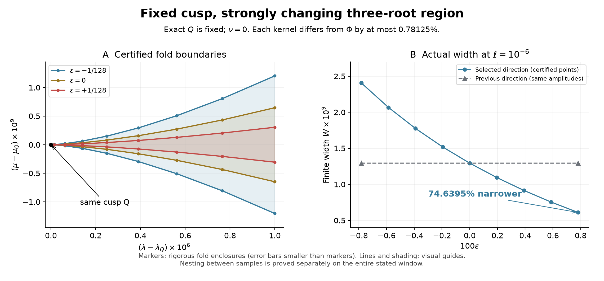
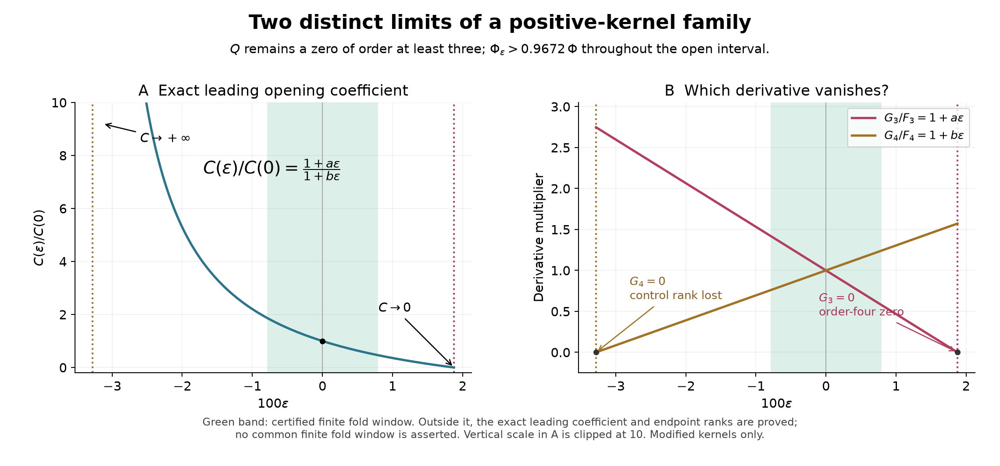

# R09 — Cusp sabitken geometriyi tasarlamak

20 Eylül 2026. Bu aşama, R08 sonunda açık bıraktığımız şu soruyu
cevaplıyor: **Q cusp'ını tam yerinde tutan pozitif çekirdeklerde,
çevresindeki üç gerçek köklü bölgeyi daha güçlü değiştirebilir miyiz?**

Evet. İlk 16 kosinüs modu içinden seçtiğimiz dört mod, Q'yu tam korurken
hem güçlü bir sonlu daralma hem de açıklık katsayısını ayarlayan tam
bir formül verdi. Aynı ailede daha ileride gerçek bir dörtlü kök de
oluşturulabiliyor. Bunlar değiştirilmiş çekirdek ailesine ait sonuçlar.

## 1. Somut sonlu sonuç

Yeni çekirdek Φε=Φ(1+εh*) biçiminde. h*, frekansları 10,13,15,16
olan dört kosinüsün birleşimi; katsayıları Q'daki üç momentin tam
kofaktörleriyle tanımlanıyor. Böylece Q'nun konumunu yaklaşık olarak
yeniden bulmak gerekmiyor: F=Ft=Ftt=0 özdeşlikleri orada tam korunuyor.
Her noktada |h*|≤1.

ε∈[−1/128,+1/128] boyunca:

- Her çekirdek, başlangıç Φ'den göreli olarak en fazla **%0,78125**
  farklı; pozitiflik korunuyor. İki uç çekirdek arasındaki fark için
  aynı yüzde söylenmiyor: onun üst sınırı Φ'ye göre %1,5625.
- Q sabit; aynı |t−tQ|≤0,003, |λ−λQ|≤10⁻⁶,
  |μ−μQ|≤2×10⁻⁹ penceresinde tam bir/üç gerçek kök ayrımı geçerli.
- Üst fold aşağı, alt fold yukarı hareket ediyor. Dolayısıyla üç
  köklü bölgeler gerçekten iç içe daralıyor.
- ℓ=λ−λQ=10⁻⁶ kesitinde ε'yi −1/128'den +1/128'e götürmek,
  **sonlu gerçek genişliği %[74,63952480;74,63952481] daraltıyor.**

| Aynı ℓ=10⁻⁶ kesiti | ε=−1/128 | ε=0 | ε=+1/128 |
|---|---:|---:|---:|
| W×10⁹, yaklaşık | 2,4067339885 | 1,2946095162 | 0,6103591761 |

Önceki dört düşük frekanslı yön, **aynı genlik aralığında** yalnızca
yaklaşık %0,00078033 daralma veriyordu. Eski ±1/2 sonucuyla farklı
genlikleri karıştırarak karşılaştırma yapılmadı. Başterim C'nin yeni
daralması yaklaşık %74,63954595; sonlu W için onun yerine yukarıdaki
doğrudan fold hesabı kullanıldı.

Şekildeki noktalar doğrulanmış fold kutularından geliyor. Çizgiler
görsel kılavuz; aradaki bütün bölgede daralma ayrı sürekli alan
kanıtıyla sağlanıyor. Sayıların dışa yuvarlanmış kaynağı
[key_results.json](results/key_results.json).

## 2. “Daha güçlü” sözü için bir üst sınır da var

İlk 16 kosinüs modu, üç tam moment kısıtı ve Σ|wj|≤1 katsayı bütçesi
içinde **başlangıçtaki logaritmik açıklık daralma hızını en büyük
yapan yönü** bulduk. Bu yalnızca taramadaki en iyi aday değil:
dual eşitsizlik bütün bu sınıfa bir üst sınır koyuyor ve seçtiğimiz
yön o sınıra tam ulaşıyor. Yönün bu yönelimle tekliği de kanıtlanıyor.

Doğrulanan en büyük hız S≈83,766976561084. Önceki yönün aynı
başlangıç hızına oranı yaklaşık 167.732. Bu oran sonlu genişlikte
aynı büyüklükte bir daralma oranı demek değil. Tüm sınırlı fonksiyonlar
için evrensel optimum veya herhangi bir sonlu ℓ'de optimum iddia
edilmiyor. Kullanılan doğrusal programlama dualitesi standart;
katkı adayı, bu özel integral ve moment kısıtları için doğrulanan sonuç.

## 3. İstediğimiz açıklık katsayısını elde etme

Yerel genişlik W(ℓ,ε)=C(ε)ℓ^(3/2)+O(ℓ²) biçiminde. Tam formül

\[
\frac{C(\epsilon)}{C(0)}=\frac{1+a\epsilon}{1+b\epsilon},\qquad
a\simeq-53.2790015122,\quad b\simeq30.4879750489.
\]

Her r>0 için ε=(1−r)/(rb−a) seçimi C(ε)=rC(0) veriyor.
Bütün bu seçimlerde Q yerinde, çekirdek pozitif ve cusp dejenerasyonsuz;
hatta Φε>0,9672Φ. Bu, açıklığı yalnızca küçükçe değiştirmenin ötesinde,
**yerel katsayıyı önceden belirlediğimiz bir hedefe ayarlayabilmek** demek.

Burada ölçtüğümüz C, özgün λ ve μ birimlerine bağlı. Keyfî kontrol
koordinatı değişimleri altında değişmeyen bir sayı değil. Çok büyük C
değerleri, seçtiğimiz kontrollerin dejenerasyona yaklaşmasıyla birlikte
geliyor. Bu sebeple teorem “aynı sonlu pencere sınırsız büyür” demiyor;
her r için yeterince küçük bir yerel pencereyi konu alıyor. Somut ortak
pencere yalnızca önceki bölümdeki güvenli aralıkta doğrulandı.

## 4. İki sınır birbirinden farklı

| Genlik | Gerçekte olan | Olmayan çıkarım |
|---|---|---|
| ε≈−0,032799816924 | Gtttt=0, Gttt>0; λ,μ kontrollerinin cusp açılımı rank kaybediyor, C→∞ | Dörtlü kök bulunduğu söylenmez |
| ε≈+0,018769120509 | G=Gt=Gtt=Gttt=0 ve Gtttt<0; kök tam dörtlü | Özgün değiştirilmemiş çekirdekte dörtlü kök bulunduğu söylenmez |

İkinci noktada λ,μ,ν kontrollerinin ilgili türev matrisi rank üç.
Bu nedenle sıfır kümesi, uygun yerel analitik koordinatlarda
x⁴+ux²+vx+w=0 biçimine indirgeniyor. Bunun potansiyel biçimi standart
swallowtail geometrisine karşılık gelir. Terimlerin kaynağı
[NIST DLMF §36.2](https://dlmf.nist.gov/36.2#i); bizim integral için
indirgeme kanıtı [PROOF.md](PROOF.md) içinde yazılı.

Yeşil alan ortak sonlu pencerenin doğrulandığı aralık. Dörtlü kökün
çevresinde fiziksel kontrol koordinatlarıyla açık boyutlu bir
swallowtail kutusu henüz verilmedi. Mevcut sonuç yerel normal biçim,
tam kök çokluğu ve kontrol bağımsızlığıdır.

## 5. Makaleye katkısı ve sınır

Çalışmanın yeni güçlü cümlesi şu olabilir:

> Bu pozitif integral ailesinde cusp konumunu tam sabit tutan
> çekirdek değişimleriyle yerel açılma katsayısı önceden belirlenebilir;
> seçilmiş bir yönde sonlu üç köklü bölgenin sıkı daralması ve daha
> ileride tam dörtlü köke geçiş doğrulanabilir.

Bu cümledeki kanıtlanmış içerik yukarıdaki aile, koordinatlar ve
pencerelere bağlı. Genel cusp kuramını, moment-nullspace yöntemini,
dualiteyi veya Weierstrass hazırlama teoremini yeni diye sunamayız.
Özgünlük adayı, bu yapıları özel integralde aynı konum korunurken
nicel sonlu geometri ve bir sonraki dejenerasyonla birleştirmemizdir.
Yakın literatürde bu birleşimin önceliği henüz belirlenmedi.

R08 bütün ν yayı için başka bir yönü doğrulamıştı; R09 yeni yön için
ν=0 kesitini doğruluyor. R09'un güçlü değişimini bütün eski cusp yayına
aktarılmış gibi yazmıyoruz. Ayrıca fiziksel sistem, gerçek zaman veya
kararlılık modeli tanımlanmadığı için fiziksel faz geçişi bulduğumuzu
söyleyemeyiz. Riemann hipotezi hakkında da sonuç yok.

Hakemli makale bakımından benim değerlendirmem: yeni adım, yalnızca
çok sayıda cusp örneği göstermekten daha belirgin bir araştırma sorusu
ve teorem zinciri sağlıyor. Yayınlanabilirliğin belirleyicileri hâlâ
literatürde ayrımın netleştirilmesi, analitik kanıtların dış uzman
incelemesi ve hesap paketinin hakem tarafından yeniden üretilebilmesi.
Bu değerlendirme bir kabul veya akademik unvan eşdeğerliği iddiası değil.

## 6. Güven zinciri ve sonraki soru

288 frekans kaydırmalı rigoröz integral, 110 doğrudan yeni F/H
integrali, eski yön için 34 karşılaştırma integrali var. Tasarım ve
dörtlü kök rankı ayrı rasyonel aritmetikle kontrol edildi. Yeni yerel
Taylor sınırları ve 16 genlik hücresi ayrı denetçide yeniden kuruldu;
15 teklik birleşmesi doğrulandı. Sonlu şekiller için 176 fold daralma
kutusu ve 16 genişlik karşılaştırması kontrol edildi. Dokuz integral
90 ve 115 basamakta ayrı mpmath hesabıyla uyuştu.

Bunlar dış hakem denetimi değil; rasyonel denetçiler integral
kapsamalarını ve mutlak majorantları girdi kabul ediyor. Başarısız
ara sınır ve iki yazılım tür hatası [DIAGNOSTICS.md](DIAGNOSTICS.md)
içinde açıkça kayıtlı. Önceki sonuçlar değiştirilmedi.

Sonraki en somut soru: **oluşturduğumuz dörtlü kökün yakınında iki
cusp kolunu ve 0/2/4 gerçek köklü bölgeleri, özgün λ,μ,ν
koordinatlarında açık boyutlu bir kutuda doğrulayabilir miyiz?**
Bu sorunun nitel yerel cevabı normal biçimden geliyor; açık kutu,
kalan sınırları ve doğrulanmış örnekler yeni çalışmanın konusu olur.
Özgün çekirdekte dörtlü kök arayışı ise ayrı bir araştırma sorusudur.

[Kanıt](PROOF.md) · [Yeniden üretim](README.md) ·
[İngilizce teorem eki](THEOREM_APPENDIX.tex) ·
[Çalışma defteri](../CALISMA_DEFTERI.md)
