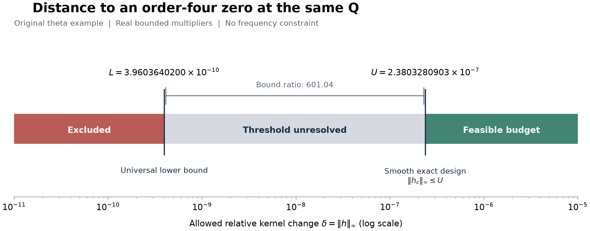

# R11 — Tasarımın koşulları ve en küçük çekirdek değişimi

21 Eylül 2026. Bu paket, mevcut aileyi temel örnek olarak koruyup
tasarımın genel koşullarını açığa çıkarma kararını işler. Seçilen tek
genişletme, **aynı Q'daki üçlü sıfırı dörtlü sıfıra çevirmek için gereken
en küçük bağıl çekirdek değişimini belirlemek**.

Genel savlar [İngilizce ispat taslağında](PROOF.md) gerekçelendirildi.
Özel aileye ait ilk nicel sınırlar ayrı hesaplarla denetlendi. Dış
uzman incelemesi ve literatürde öncelik değerlendirmesi yapılmış değil.
Bu ayrım, yeni bulguların eski notlara karışmasını önlemek için açıkça
korunuyor. Başlangıçtaki makale TeX'i kullanılmadı ve değiştirilmedi.

## 1. Ne değişti, neyi ölçüyoruz?

Başlangıç ailesi

\[
F(t;\lambda,\mu,\nu)=\int_0^\infty K(u)
 e^{\lambda u^2+\mu u^4+\nu u^6}\cos(2tu)\,du.
\]

Bir kez seçilip bütün kontrollerden bağımsız tutulan gerçek h ile
K_h=K(1+h) kuruyoruz. Bütçe δ=||h||∞; yani integral değerinin
değişimini değil, **çekirdeğin noktalara göre en büyük bağıl değişimini**
ölçüyoruz. δ<1 pozitifliği koruyor. Ölçülebilir h için bu ifadeler
hemen her yerde, düzgün adayımız için noktasal anlam taşıyor.

Mevcut cusp noktasında F=F_t=F_tt=0, F_ttt≠0. Koordinatları
değiştirmeden ilk üç eşitliği koruyor, ayrıca F_ttt'yi sıfırlıyoruz.
F_tttt≠0 koşulu sıfırın tam dördüncü mertebeden olduğunu gösteriyor.
λ,μ,ν kontrol matrisinin rankının üç olması, bu sıfırın çevresindeki
yerel açılımın dejenerasyonsuz olmasını sağlıyor.

Burada h için bir frekans veya türev sınırı koymadık. Bütçeye böyle bir
kısıt eklemek ayrı bir optimizasyon problemi oluşturur.

## 2. Tasarımın hangi koşullara dayandığı açığa çıktı

| Koşul | Görevi | Sonucun sınırı |
|---|---|---|
| K≥0 ve en az bir açık aralıkta hemen her yerde pozitif yoğunluk | Sonlu türev momentlerinin bağımsızlığını sağlar. | Keyfî imzalı veya yalnızca atomik ölçülere aynı ispat uygulanmıyor. |
| Gerekli üstel momentlerin sonluluğu | İntegral altında türevleri ve yerel analitik kontrol ailesini gerekçelendirir. | Yazılan koşul yeterli; en zayıf mümkün koşul olduğu iddia edilmiyor. |
| Sabit noktada t_Q≠0 | Sinüs/kosinüs türev fonksiyonlarının bağımsızlığını sağlar. | t_Q=0 aynı teoremin kapsamında değil. |
| h tek bir sabit fonksiyon ve ilk üç moment değişimi tam sıfır | Q'nun tam konumunu korur. | Çok küçük sayısal artık tek başına tam konum korunumu sayılmıyor. |
| ||h||∞<1 | Pozitif çekirdek sınıfında kalmayı sağlar. | Büyük moment hedefleri için tek başına küçük bütçe garantisi vermez. |

Bu koşullar altında **sonlu sayıda türevi yeterince küçük miktarlarda
birbirinden bağımsız ayarlayabiliyoruz**. İspat, pozitif bir Gram
matrisinden açık bir sağ ters kuruyor. İlk üç momenti sabit tutup
sonrakileri değiştirme olanağı yalnızca theta çekirdeğine özgü değil.
Belirli dört kosinüs kullanıldığında ise onların özel moment matrisinin
terslenebilirliği yine ayrıca kontrol edilmeli.

Bu genel mekanizma klasik moment yöntemlerine dayanıyor. Bilimsel
değerini, yöntemi yeni adlandırmaktan değil, **hangi geometriye ne
kadar değişimle erişildiğine açık sınırlar vermekten** bekliyoruz.

## 3. Sonsuz boyutlu soruyu üç değişkenli bir probleme indirdik

Q'da dρ=K exp(λ_Q u²+μ_Q u⁴+ν_Q u⁶)du ve
p_j(u)=(2u)^j cos(2t_Q u+jπ/2) olsun. f_j=∫p_jdρ yazalım.
Üç momenti tam koruyan ve üçüncü türevi sıfırlayan bütün sınırlı
gerçek h'ler için en küçük maliyet δ_* olsun. İspat taslağı şu tam
ifadeyi veriyor:

\[
D=\min_{a_0,a_1,a_2\in\mathbb R}
\int_0^\infty |p_3-a_0p_0-a_1p_1-a_2p_2|\,d\rho,
\qquad \boxed{\delta_* = |f_3|/D.}
\]

Bu bir yaklaşık Taylor formülü değil. Moment kısıtları tam olduğunda
geçerli bir minimum-norm ifadesi. Kanıt; sonlu boyutlu L1 yaklaşımı,
işaret fonksiyonu ve açık bir alt sınır eşitsizliği kullanıyor. Bu
araçların kendisinde yenilik iddia etmiyoruz.

Dolayısıyla sonsuz sayıda olası h aramak yerine üç gerçek katsayıyı
araştırabiliriz. Ancak amaç fonksiyonu hâlâ sonsuz aralıkta bir
mutlak-değer integrali. D'yi sertifikalamak için artık fonksiyonun
sıfırları, integral hataları ve kuyruklar kontrol edilmeli. Bu pakette
D'nin sayısal minimumunu hesaplamadık.

İki ek ayrıntı:

- Yoğunluk bütün (0,∞)'da hemen her yerde pozitifse δ_*<1 olduğu
  analitik olarak çıkıyor. Bu, bütün çekirdekler için 1'den aynı
  miktarda uzak bir sınır vermez.
- En iyi ölçülebilir h genellikle sıçramalı bir işaret fonksiyonu.
  Buna rağmen düzgün, pozitifliği koruyan ve tam dörtlü sıfır/rank üç
  sağlayan değişimler için **infimumun aynı olduğunu** gösterdik.
  Düzgün sınıfta minimumun elde edildiğini iddia etmiyoruz. Düzgün
  yaklaşık fonksiyonların moment hataları sağ tersle tam düzeltiliyor.

## 4. Temel örnekte ilk kanıtlı alt ve üst sınırlar

Özgün theta çekirdeği Φ ve R01'in tam Q noktası için yeni aday

\[
h_c(u)=\sum_{j\in\{40,41,42,43\}}w_j\cos(2ju)
\]

kuruldu. Katsayılar yuvarlanmış ondalıklardan değil, dört tam moment
denkleminden tanımlanıyor. Denklem matrisinin terslenebilirliği ve
gerekli işaretler aralık aritmetiğiyle doğrulandı.

\[
\boxed{3.96\times10^{-10}<\delta_*<2.381\times10^{-7}.}
\]

Daha hassas dışa yuvarlanmış aralık
**[0.00000000039603640200, 0.00000023803280902557]**.

| Sonuç | Gerekçe | Ne anlama geliyor? |
|---|---|---|
| Evrensel alt sınır | Her uygun h için \|h\|∞≥\|f₃\| / ∫(2u)³dρ. | Sınırın altındaki bütçe, izin verilen hiçbir h ile hedefi sağlayamaz. |
| Yeni düzgün adayın üst sınırı | \|h_c\|∞≤Σ\|w_j\|<2.381×10⁻⁷. | Bu kadar küçük bir bütçede hedefin gerçekleştirilebildiği kanıtlı. |
| Tam dörtlü sıfır | 10¹³g₄∈[-9.7629645301,-9.7629645300]. | İlk dört türev sıfır, sonraki türev sıfırdan farklı. |
| Kontrol rankı üç | 10⁴⁰ det J∈[-4.4646224041,-4.4646224040]. | λ,μ,ν kontrolleri gerekli yerel açılımı sağlıyor. |

Üst sınırdaki Σ|w_j|, adayın gerçek supremum normuna bir üst sınır;
normun tam değeri veya optimumu olarak kullanılmıyor. İki sınırın
oranı yaklaşık **601,04**. Aralık geniş: minimumu bulduk demiyoruz.
Alt sınır henüz üç konum-koruma kısıtının sağladığı ek bilgiyi
kullanmıyor. D problemi bu bilgiyi kullanmanın doğrudan yolu.

Şekilde kırmızı alan mevcut alt sınırla dışlanıyor; gri alan eşik
bakımından çözülmemiş; yeşil alandaki bütçeler kurduğumuz adayı içeriyor.
Yatay eksen logaritmik. Bu bir kök-sayısı haritası değil.

## 5. Önceki bulgularla ilişkisi

R09'un ilk 16 kosinüs içindeki optimumu, başlangıçtaki logaritmik
açıklık değişim hızına ve katsayı l1 bütçesine aitti. Burada hedef,
norm ve izin verilen fonksiyon sınıfı farklı. Yeni küçük üst sınır,
R09'un kendi problemi için verdiği optimumla çelişmiyor.

Yeni h_c, R10'da sonlu 0/2/4 kök geometrisi incelenen çekirdekten
farklı. R10'un kutu boyutları veya şekilleri buraya taşınmadı. Bu
paket özgün sabit Φ ailesinde dörtlü sıfır kanıtlamıyor; Φ'nin açıkça
tanımlanan pozitif bir değişiminde kanıtlıyor. Global kök sayısı,
fiziksel kararlılık veya fiziksel sistem iddiası yok.

## 6. Hesap ve kayıt güvenilirliği

Yeni hesaplar 72 kaydırılmış integral, bir pozitif mutlak moment
integrali ve dokuz doğrudan çarpım-biçimli integral içeriyor: toplam
**82 yeni rigoröz integral değerlendirmesi**. Son dokuz integral,
aynı adayın doğrudan integrali ile spektral kaydırma yolunu karşılaştırıyor.
Üç değer ayrıca mpmath ile 90 ve 115 basamakta karşılaştırıldı.

FLINT kullanmayan ayrı rasyonel denetçi, katsayıları Cramer yöntemiyle,
tam 3×3 kontrol determinantını ve norm sınırlarını yeniden hesaplıyor.
Bu denetçi integral kapsamalarını girdi kabul ediyor; bütün analitik
integrasyonu bağımsız bir kütüphanede kanıtladığı söylenmiyor. Genel
ispat taslağı da bu aritmetik kontrollerden ayrı değerlendirilmelidir.

Kapanış denetiminin ilk sürümünde bir kayıt-kontrol hatası yakalandı:
Arb aralıkları yeniden yüklenirken yarıçap dışa yuvarlanabildiği hâlde
eski ve yeni kaydın birebir aynı olması istenmişti. Doğru koşul olan
aynı tam merkez ve eski aralığı içerme, altı temel türev ve dokuz
karşılaştırma aralığında kontrol edildi. Hatalı kural iki ayrı kayıt
geçişindeydi; iki başarısız ön denetim sürümü de saklandı. Hesap
çıktıları ve sınırlar değişmedi; önceki denetçiler ve
[tanılama kaydı](diagnostics/audit_repacking_check.json) saklandı.

[Ana sertifika](results/candidate_certificate.json),
[ayrı rasyonel kontrol](results/candidate_check.json),
[integral karşılaştırması](results/integral_crosscheck.json),
[kaynaklar ve okuma kapsamı](REFERENCES.md),
[yeniden üretim ve kapsam](README.md).

## 7. Tek devam sorusu

**Aynı Q ve aynı bağıl norm için üç değişkenli D problemini rigoröz
olarak çözerek alt sınırı ne kadar yükseltebiliriz; buna yaklaşan
düzgün pozitif bir tasarım kurabilir miyiz?**

Bu soruya yoğunlaşmak, mevcut aileyi ayrıntılı temel örnek olarak
tutarken genel bir koşulluluk ve erişilebilirlik ölçüsü kazandırır.
Başka aile sayısını artırmak, yeni bir sonlu kök haritası çıkarmak
veya bir fiziksel model eklemek bu aşamanın gereği değil.
