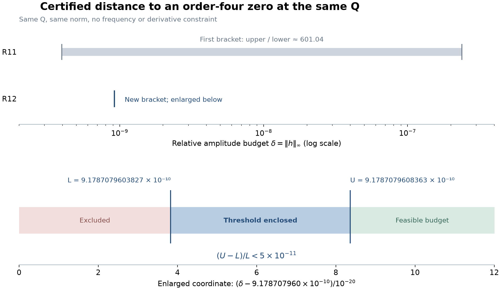
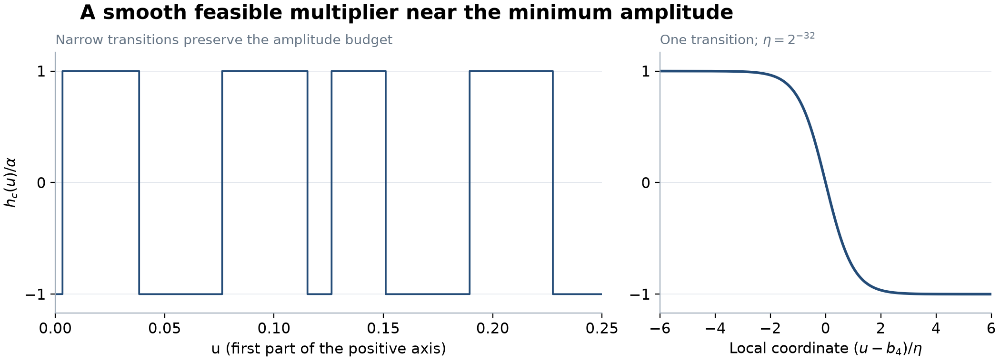

# R12 — Aynı cusp noktasında en küçük değişimi dar bir aralığa aldık

21 Eylül 2026. R11'in tek devam sorusu işlendi: aynı tam Q'daki
üçlü sıfırı dörtlü sıfıra dönüştürmek için gereken en küçük bağıl
çekirdek değişimi. Yeni paket, önceki hesaplara ekleniyor; önceki
paketler ve eski makale TeX'i değiştirilmedi.

## 1. Yeni sonuç

δ_* izin verilen en küçük ||h||∞ maliyeti olmak üzere,

\[
\boxed{
9.1787079603827\times10^{-10}<\delta_*
<9.1787079608363\times10^{-10}.
}
\]

Ondalık dış uçlar:
**[0.00000000091787079603827, 0.00000000091787079608363]**.
Bu iki ucun bağıl farkı **5×10⁻¹¹'den küçük**. Önceki aralıkta
üst/alt sınır oranı yaklaşık 601,04 idi; artık oran 1+5×10⁻¹¹'den
küçük. Yaklaşık değer δ_*≈9,17870796×10⁻¹⁰.

Bu büyüklük, çekirdeğin noktalara göre en büyük bağıl değişimi.
İntegral değerinin, bir kökün yer değiştirmesinin veya fiziksel
gürültünün ölçüsü olarak kullanılmıyor.

| Taraf | Kanıtlanan anlam |
|---|---|
| Alt uç | Bütün sınırlı gerçek h'ler arasında, aynı Q'yu koruyup üçüncü türevi sıfırlayan bir değişimin maliyeti bundan küçük olamaz. |
| Üst uç | Bu bütçe içinde gerçek analitik, pozitifliği koruyan, aynı Q'da tam dörtlü sıfır ve rank üç açılım sağlayan bir h gerçekten tanımlandı. |
| Yakınlık | Kurulan düzgün tasarımın maliyeti, gerçek infimumun 1+5×10⁻¹¹ katından küçük. |

Bu, yalnızca optimizasyon yazılımının yaklaşık cevabı değil.
Eşiğin iki tarafında farklı matematiksel gerekçeler var. Her bu
büyüklükteki değişimin dörtlü sıfır oluşturduğu söylenmiyor;
üst taraf belirli bir uygun tasarımın varlığını gösteriyor.

Alt panelin ekseni, yeni aralığı görünür kılmak için açıkça belirtilen
bir kaydırma ve ölçekleme kullanıyor. Çizilen uçlar sertifika verisi;
ortadaki bilinmeyen bir değere kesin optimum etiketi konmadı.

## 2. Bu kadar dar bir sınır nasıl kurulabildi?

Önce üç katsayılı L1 problemiyle bir artık fonksiyonu r ve onun
işaret değişimleri bulundu. Bu arama yalnızca aday üretmek içindi.
Sonra katsayılar ve işaret geçiş noktaları tam ikili rasyonel
sayılar olarak sabitlendi.

Alt sınır için, her uygun h'nin
|F_ttt(Q)|≤||h||∞ ∫|r|dρ eşitsizliğini sağladığını kullandık.
Artığın [0,1] aralığındaki 28 sıfırı kutularla ayrıldı. Geri kalan
113 aralıkta işaret kanıtlandı. Kutular ve işaret aralıkları bütün
[0,1]'i boşluksuz kapsıyor; sonsuzdaki bölüm ayrıca kuyruk
eşitsizliğiyle kontrol ediliyor. Böylece ∫|r|dρ için rigoröz üst
sınır, δ_* için rigoröz alt sınır elde ediliyor.

Üst sınır için işaret fonksiyonunu doğrudan bırakmadık: pozitif bir
yumuşatma çekirdeğiyle düzgünleştirdik. Pozitif yumuşatma, genlik
sınırını koruyor. Yeni analitik hata hesabı, her türev momentindeki
yumuşatma hatasının **N M_j η²** ile sınırlanmasını sağlıyor.
Burada N geçiş sayısı, M_j ilgili ağırlıklı moment fonksiyonunun
Lipschitz sınırı, η yumuşatma genişliği.

Bu ikinci dereceden hata sınırının ardından kalan moment hatalarını
dört kosinüsle tam düzelttik. Önceki pakette terslenebilirliği
kanıtlanmış 40,41,42,43 moment matrisi burada düzeltme aracı olarak
kullanılıyor. Sonuçtaki katsayılar tam moment denklemiyle tanımlı;
yuvarlanmış sayıların küçük artıklarına dayanılmıyor.

## 3. Geometrik hedef de korunuyor

Yeni tasarımda ilk dört türev tam sıfır. Sonraki türev ve üç kontrol
determinantı ayrı rasyonel hesapla doğrulandı:

- 10¹³g₄ ∈ **[-9.721188538,-9.721188537]**.
- 10⁴⁰det J ∈ **[-4.249937772,-4.249937771]**.

Böylece aynı Q'da sıfırın mertebesi tam dört ve λ,μ,ν kontrolleri
rank üç. Çekirdek pozitif kalıyor. Bu sonuç, özgün Φ'nin yeni bir
pozitif değişimine ait. R10'un sonlu 0/2/4 kök bölgeleri bu yeni
çekirdeğe aktarılmadı.

Şekil katsayı aralıklarının orta noktalarıyla çizilen temsili
görünüm. Tam konum korunumu çizimden değil moment denkleminden;
norm sınırı da çizimin piksel yüksekliğinden değil sertifikadan geliyor.

## 4. Yeni bir nitel ayrım: düzgün sınıfta tam minimum yok

R11'in analitik dualite sonucunun eşitlik koşulundan bir sonuç daha
çıkıyor. Bu örneğin yoğunluğu bütün pozitif eksende pozitif olduğu
için **en küçük maliyeti elde eden ölçülebilir çarpan sıçramalı**.
Dolayısıyla sürekli, dolayısıyla düzgün çarpan sınıfında tam
minimum elde edilmiyor. Düzgün tasarımların infimumu aynı; ona
istenildiği kadar yaklaşılabiliyor.

Gerekçe, en iyi çarpanın bir analitik artık fonksiyonunun işaretine
eşit olmak zorunda olması. Artık hem pozitif hem negatif değerler
alıyor. Pozitif yoğunluklu aralıklarda karşıt sabit değerlere eşit
olan bir fonksiyon, aradaki işaret değiştiren sıfırda sürekli olamaz.
Bu sonuç genel bir yeni dualite ilkesi iddiası değil; klasik eşitlik
koşulunun bizim tam pozitif destekli örneğimize uygulanması.

Bu nedenle hedefi doğru ifade ediyoruz: **düzgün tasarımda tam optimum**
yerine, **en küçük mümkün maliyete kanıtlı yakınlık**. Kurduğumuz
tasarım için yakınlık payı 5×10⁻¹¹'den küçük.

## 5. Sonucun en önemli sınırı

Normumuz yalnızca genliği ölçüyor. h için frekans, türev veya
Lipschitz bütçesi koymadık. Seçilen yumuşatma genişliği
η=2⁻³²≈2,3283×10⁻¹⁰; geçişler çok dar. Fonksiyon düzgün olsa da
türev normunun küçük olduğu sonucu çıkmıyor. α/η≈3,94 yalnızca
geçiş eğiminin açıklayıcı ölçeği; ayrıca sertifikalanmış tam türev
normu olarak sunulmuyor.

Bu, araştırmanın matematiksel kapsamı. Sonuç bir fiziksel
dayanıklılık ölçüsü veya her tür küçük gürültü için kararlılık
teoremi değil. Türev/frekans kısıtı eklenirse yeni bir optimizasyon
problemi oluşur; mevcut dar aralık o probleme aktarılamaz.

## 6. Doğrulama ve bilimsel değer

261 yeni Arb integral değerlendirmesi yapıldı: 29 aralıkta dokuz
türev momenti. Kök kutuları, işaret örtüsü ve global türev
majorantları integral çevresindeki hataları kontrol ediyor. Ayrı
rasyonel denetçi moment toplamını, yumuşatma hatalarını, adjugat
çözümü, tam kontrol determinantını ve ortak norm aralığını yeniden
hesapladı. Üç moment, farklı sayıda theta terimi ve mpmath
Gauss–Legendre integraliyle 50/80 basamakta karşılaştırıldı.

Rasyonel denetçi integral kapsamalarını, trigonometrik aralık
değerlerini ve analitik majorantları girdi kabul ediyor. Düzgün
çarpanın çok dar geçişleri ayrıca numerik olarak integre edilmedi;
moment etkileri kanıtlanan η² sınırıyla kontrol edildi. Genel
ispat taslağı dış uzman incelemesi bekliyor.

İki yazılım kontrol sorunu sertifika öncesinde yakalanıp kaydedildi:
maliyet aralığının bütününü sıralamak yerine doğru üst ucun
kullanılması; rasyonel denetçide 2⁻⁵¹² ızgarasından daha ince
tam ikili sayıların kayıpsız okunması. Başarısız sürümler ve
gerekçeler `diagnostics/` içinde saklandı.

Araştırma açısından kazanım, belirli bir pozitif integral örneğinde
geometrik hedefe erişmenin maliyetine **bütün uygun değişimleri
kapsayan bir alt sınır ile ona yaklaşan düzgün bir tasarımı aynı
teoremde bağlayabilmek**. Bu, örneğin yalnızca varlığını göstermekten
daha fazla nicel bilgi veriyor. Klasik dualite ve yumuşatma
yöntemlerinde yenilik iddia edilmiyor; özel nicel sonucun literatür
önceliği ayrıca incelenmeli.

[Tam ispat](PROOF.md), [sertifika](results/threshold_certificate.json),
[rasyonel kontrol](results/threshold_check.json),
[sayısal integral karşılaştırması](results/moment_crosscheck.json),
[yeniden üretim](README.md), [kaynaklar](REFERENCES.md).
