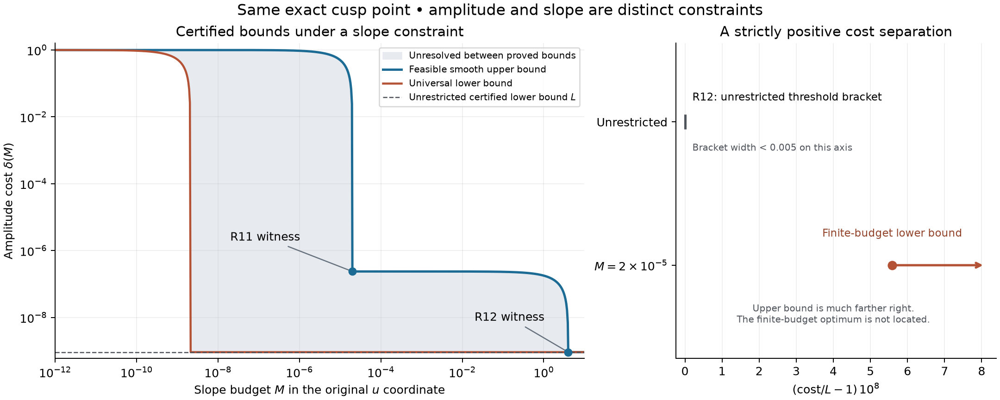

# R13 — Değişme hızını da sınırladığımızda maliyet nasıl değişiyor?

21 Eylül 2026. R12'nin açık bıraktığı norm sorusuna devam ettik.
Önceki sonuç yalnızca çekirdek çarpanının genliğini ölçüyordu. Bu aşamada
aynı tam Q, aynı dört moment hedefi ve aynı pozitif theta örneği korunuyor;
ek koşul çarpanın ne kadar hızlı değişebileceği:

\[
 |h(u)-h(v)|\le M|u-v|.
\]

Düzgün h için bu, sup|h′|≤M demektir. Türev u'ya göre; fiziksel zaman,
deneysel gürültü veya Fourier frekansı olarak yorumlanmıyor.

## 1. Önceki eşiği geçersiz kılmayan, onun kapsamını açıklayan sonuç

δ(M), bu ek koşul altında aynı moment hedefinin en küçük genlik
maliyeti olsun. Analitik ispat taslağı şu yapıyı veriyor:

- Her sonlu M için **Lipschitz sınıfında minimum elde ediliyor**.
- Her 0<M<∞ için **δ*<δ(M)<1**. Yani sabit sonlu değişme hızı bütçesi,
  sınırsız problemin eşiğine tam ulaşmayı engelliyor.
- δ(M), M arttıkça sıkı azalıyor ve konveks; M→∞ iken δ*'a yaklaşıyor.
- M→0 iken δ(M)→1. Düzgün, pozitif, tam dörtlü/rank üç tasarımlar için
  de her M>0'da aynı infimum var; bu daha dar sınıfta minimumun elde
  edildiğini söylemiyoruz.

Önceki sonuçta sürekli sınıfta minimum yoktu; burada minimumun varlığı
bir çelişki değil. **Sabit eğim sınırı** kaçış biçimini engelliyor,
kompaktlık sağlıyor ve minimumu daha yüksek bir maliyete taşıyor.
Kompaktlık yarı eksenin tamamında tekdüze normla varsayılmıyor;
sonlu aralıklarda alt dizi ve integralde baskın yakınsama kullanılıyor.

Bu argümanlar klasik araçların uygulanması. Dış matematikçi incelemesi
bekliyor; genel bir yeni kompaktlık/dualite yöntemi iddia etmiyoruz.
[Ayrıntılı ispat](PROOF.md), [kaynak okuma kapsamı](REFERENCES.md).

## 2. Artış için somut bir sayısal ayırım da var

M=0,00002 seçildiğinde:

\[
 \boxed{0.000000000917870847<\delta(0.00002)
               <0.00000023803280902557.}
\]

Bu yeni **alt** sınır, R12'nin sınırsız problem için bulduğu
0,00000000091787079608363 **üst** sınırından büyük. Dolayısıyla ek
kısıtın maliyet yarattığını yalnız nitel gerekçeyle değil, aralık hesabıyla
da ayırabiliyoruz. Artışın alt sınırı küçüktür; yeni alt/üst aralık geniştir.
Maliyetin üst sınıra kadar yükseldiği veya yeni optimumun keskin hesaplandığı
söylenmiyor.

Gerekçe: R12'nin dual artık fonksiyonu işaret değiştirirken, sınırlı
eğimli bir h iki karşıt değere aniden geçemez. İşaret değişiminin iki
yanını birlikte değerlendirerek kaybolan katkıya pozitif alt sınır
veriyoruz. Artığın tam sıfırı, önceki sertifikalı kutunun içinde;
yaklaşık merkez gerçek sıfır diye kullanılmıyor. Bir kutuluk bu ek kayıp
hesabı bile yukarıdaki kesin ayrımı sağlamaya yetti.

## 3. Önceki iki tasarım artık farklı eğim bütçelerinde tanık

| Tasarım | Doğrulanan genlik üst sınırı | Doğrulanan eğim üst sınırı |
|---|---:|---:|
| R11'in dört kosinüslü çarpanı | 2,3803280902557×10⁻⁷ | 2×10⁻⁵ |
| R12'nin yakın-minimum düzgün çarpanı | 9,1787079608363×10⁻¹⁰ | 4 |

R12 eğiminin hesaplanan üst sınırı yaklaşık 3,94222505; bunu ilk kez
global bir eşitsizlikle sınırladık. Önceki notta α/η yalnız açıklayıcı
bir ölçekti. Şimdi diğer bütün geçişler ve kosinüs düzeltmesi de dahil.
Yine de bu sayı tam türev normu değil, rigoröz bir üst sınırdır.

İki tasarımın aralarını karıştırınca da moment eşitlikleri, pozitiflik,
tam dörtlü kök ve rank üç korunuyor. Rank için yalnız uçları kontrol
etmedik; aradaki ikinci dereceli ifadenin üç Bernstein katsayısının
pozitifliğini doğruladık. Böylece her pozitif M için açık bir düzgün
üst-tasarım ailesi elde ediliyor. Bu aile optimum eğri olarak sunulmuyor.

Soldaki gri alan, gerçek minimumun henüz belirlenmediği alt/üst sınır
aralığı. Mavi çizgi uygun tasarımlardan, kırmızı çizgi bütün uygun h'lere
geçerli eşitsizliklerden geliyor. Sağ panel küçük fakat pozitif ayrımı
büyütüyor; R12 aralığının bu ölçekte görünür olması için bir aralık
işaretçisi var. Yatay ölçek açıkça (maliyet/L−1)×10⁸. Sağdaki ok bir
optimum noktası değil, tek taraflı alt sınır gösteriyor.

## 4. Çok küçük eğim bütçesinin anlamı

Bir pozitif momenti ayrıca hesaplayarak

\[
 \delta(M)\ge1-476270901\,M
\]

sınırını doğruladık. Örneğin M=10⁻¹⁰ için maliyet 0,9523729099'dan
büyük. Bu, bu kadar yavaş değişen bir çarpanla hedefe gitmek için en büyük
bağıl genlik farkının %95'in üzerinde olması gerektiğini söylüyor.
Bütün çekirdeğin her noktasında aynı yüzdeyle değiştiği söylenmiyor.

Bu bölümde önemli bir varsayım açık tutulmalı: **çekirdeğin toplam
kütlesini sabitlemedik**. Küçük M için uygun tasarım üretirken pozitif
bir tasarım çekirdeğini sabit bir sayıyla küçültebiliyoruz; bu, sıfırlarını
değiştirmiyor. M=0 sınırındaki h=−1 ise çekirdeği tamamen yok eder ve
pozitif/dörtlü-kök tasarımı sayılmaz. Yeni bir kütle normalizasyonu
eklemek farklı bir problem olur; burada çözülmüş değil.

## 5. Güven zinciri ve açık soru

Eski Q ve iki tasarımın kayıtları değişmedi. Yeni hesaplar; iki global
eğim sınırı, aradaki bütün karışımların rank işareti, bir artık kökü
çevresindeki türev/yoğunluk alt sınırları ve bir pozitif A₄ momenti.
A₄ için 110 basamakta 8, 135 basamakta 12 rigoröz integral paneli;
ayrıca mpmath ile 90/115 basamak karşılaştırması var. Ayrı rasyonel
denetçi bütçe, rank, kayıp ve dışa yuvarlanmış sayıları tekrar kurdu.

İlk üretim koşusunda metadata yazılırken dosya-yolu tür hatası yakalandı;
sertifika henüz yazılmamıştı. Yardımcı hash işlevi düzeltildi, ilk sürüm
ve gerekçe saklandı. Sayısal formüller değişmedi. Denetçi çıktısındaki
bir ondalık biçimlendirme de tam rasyonel yazıma geçirildi; sınır değişmedi.

Bu aşamanın kazanımı, önceki sonucun hangi düzenlilik varsayımına duyarlı
olduğunu belirlemek ve bunu somut alt/üst bütçelere bağlamak. Açık kalan
tek nicel soru: **sabit, anlamlı bir M değerinde bu geniş aralığı ne kadar
daraltabiliriz?** Tam eğri, optimum çarpanın şekli, tekliği veya düzgün
sınıfta minimumun elde edilmesi henüz belirlenmedi. R10'un sonlu kök
haritası yeni tasarımlara aktarılmadı.

[Sertifika](results/budget_certificate.json),
[rasyonel kontrol](results/budget_check.json),
[ayrı moment hesabı](results/moment_crosscheck.json),
[yeniden üretim](README.md).
