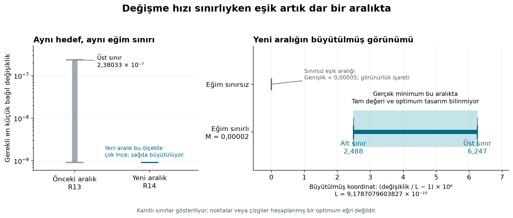
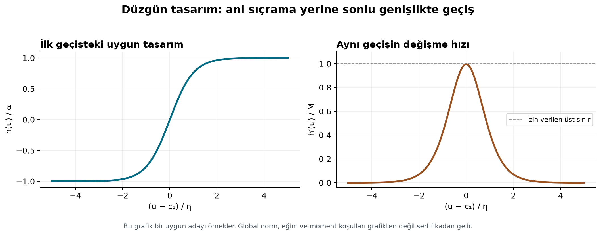

# R14 — Sabit değişme hızı sınırında gerekli değişikliği daralttık

21 Eylül 2026. Kullanıcının «devam edelim» isteğiyle, R13'ün açık bıraktığı
tek nicel soruya döndük. Sektörel kullanım hakkındaki önceki merak sorusu,
araştırma yönünü değiştirme veya fiziksel uygulama iddiası ekleme talebi
olarak alınmadı.

## Ne değişti?

Hedef, aynı tam Q noktasındaki üçlü sıfırı, pozitif çekirdeği koruyarak
tam dörtlü sıfıra çevirmek. Değişiklik Φ→Φ(1+h); büyüklüğü ∥h∥∞, değişme
hızı sınırı Lip_u(h)≤M. Buradaki u, özgün integral değişkenidir.
M=0.00002, önceki turda seçilen aynı matematiksel bütçedir.

Önceki aralık geçerli kalıyor, fakat daha iyi iki sınır elde ettik:

| | Kanıtlı alt sınır | Uygun tasarımdan üst sınır |
|---|---:|---:|
| R13 | 0.000000000917870847 | 0.00000023803280902557 |
| R14 | **0.000000000917873080** | **0.000000000917876530** |

Yeni aralığın bağıl genişliği 3.76×10⁻⁶'dan küçük; yani milyonda 3,76.
Bu bir istatistiksel güven aralığı değil, aynı matematiksel minimumun
alt ve üst sınırlarıdır. Tam optimum değeri veya optimum çarpanın şeklini
bulduğumuzu söylemiyoruz.

## Bulgunun anlamı

R12'nin sınırsız değişme hızı için verdiği minimuma δ*, bu sabit hız
sınırındaki minimuma δ(M) dersek, mevcut sınırlar birlikte

\[
2.48\times10^{-6}<\delta(0.00002)/\delta_*-1<6.25\times10^{-6}
\]

veriyor. **Bu örnek ve bu bütçede, sonlu değişme hızı koşulunun zorunlu
kıldığı ek genlik değişimi küçük ama kesinlikle pozitif: sınırsız minimumun
milyonda 2,48 ile 6,25'i arasında.** Bu oran h'nin genliği veya bütün
çekirdeğin aynı yüzdeyle değişmesi anlamına gelmiyor.

Önceki düzgün yakın-minimum tasarımda çok dar geçişler kullanılmıştı.
Yeni tasarımın yumuşatma ölçeği η=49500·2⁻³⁰; eski η=2⁻³²'ye oranı tam
198.000. Bu çok daha geniş geçişlerle de hedefe yakın-minimum genlikte
ulaşılabiliyor. Dolayısıyla önceki geniş R13 aralığının büyük kısmı,
o turdaki uygun tasarımın gevşekliğiydi. Eski üst sınırın gerçek minimum
olduğu zaten iddia edilmemişti.

## İyileştirme nasıl geldi?

**Üst sınır:** İşaret şablonunun geçişlerini genişlettik; ilk üç geçiş
konumunu küçük miktarlarda ayarladık. Sonra dört kosinüs katsayısını bir
tersinir moment sistemiyle **tam olarak tanımladık**. Sayısal artıkların
küçük olması eşitliklerin ispatı yerine kullanılmadı. Yeni çarpan çift ve
gerçek analitik; normu birden küçük, dolayısıyla çekirdek pozitif.

Global eğim üst sınırı
0.000019910351817<0.00002. Dördüncü türev ve üç kontrolün determinantı
sıfırdan uzak negatif aralıklarda; böylece aynı Q'da tam dörtlü kök ve
rank üç korunuyor. Önceki R10 sonlu 0/2/4 kök penceresi bu yeni çekirdeğe
aktarılmadı.

**Alt sınır:** R13 tek bir artık sıfırının çevresinde, sonlu eğimin
kaçınılmaz bıraktığı kaybı kullanıyordu. Aynı argümanı 28 ayrık komşuluğa
uygulayıp kayıpları topladık. Komşulukların ayrıklığı, aynı katkının iki
kez sayılmamasını sağlıyor. Bunlar yardımcı artık fonksiyonunun sıfırları;
F'nin 28 yeni sıfırı bulunmuş değil.

## Nasıl kontrol edildi?

- Önceki 14 dondurulmuş paket manifesti ve 722 dosya girdisi başlangıçta
  ve kapanışta koruma denetiminden geçirildi.
- 27 konum kaydırma integrali ve 252 yumuşatma integrali, Arb ile 110
  basamakta hesaplandı. Yeni integrallerde yaklaşık Q merkezi yerine
  tam Q'yu kapsayan parametre aralıkları kullanıldı.
- Sonsuz yumuşatma kuyruğu ve theta-serisi kesme hatası açıkça sınırlı.
- FLINT kullanmayan rasyonel denetçi momentleri, Cramer çözümünü, normu,
  eğimi, 28 kaybı ve tam 3×3 rank determinantını yeniden kurdu.
- mpmath ile özgün u koordinatında, 12 theta terimiyle, 70/100 basamak
  ve 48/64 Gauss düğümünde yapılan iki ayrı sayısal kontrol; dokuz moment,
  dört katsayı ve rank bakımından sertifikayla uyuştu. Bu kontroller
  sayısal destek; rigoröz kuyruk ispatının yerine geçmiyor.
- İki bilimsel şekil PNG/SVG olarak üretildi ve görsel olarak incelendi.

Hesap paketinin analitik kısmı dış uzman incelemesi bekleyen bir ispat
taslağıdır. Literatür önceliği bu turda araştırılmadı. Yeni genel bir
yumuşatma veya dualite yöntemi iddiası yok; kazanım aynı belirlenmiş
problemdeki nicel sınırın daraltılması ve etkinin büyüklüğünün ayrılması.

## Açık kalan yer

Sabit M'deki değer artık dar bir aralıkta, ancak bu aralığın içindeki
gerçek minimizerin biçimi ve eşik artışının M'ye bağlı ölçeklenmesi açık.
Tek M hesabından bütün M değerlerine aynı küçük artış oranı taşınamaz.
Toplam çekirdek kütlesini koruma veya sonlu frekans koşulu eklenmedi.
Bu tur araştırma sorusunu ve normu değiştirmeden ilerledi.

[İspat](PROOF.md), [sertifika](results/slope_threshold_certificate.json),
[rasyonel denetim](results/slope_threshold_check.json),
[farklı yöntemle kontrol](results/moment_crosscheck.json),
[yeniden üretim](README.md).
