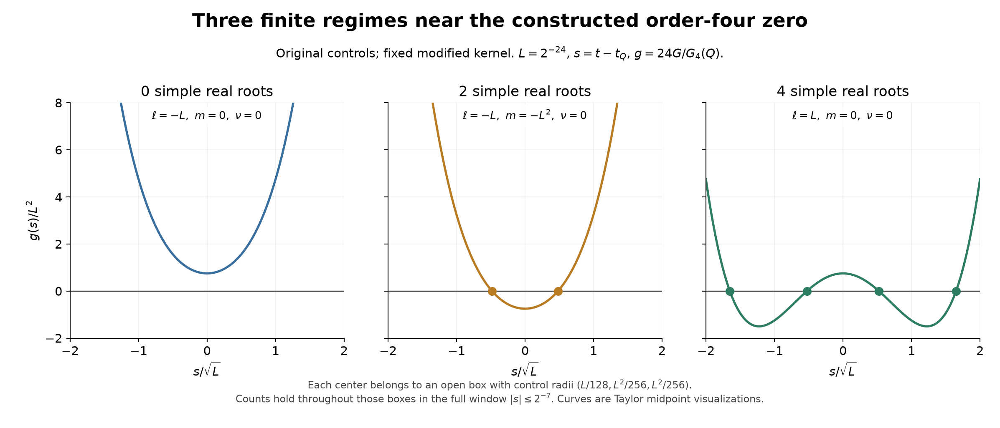
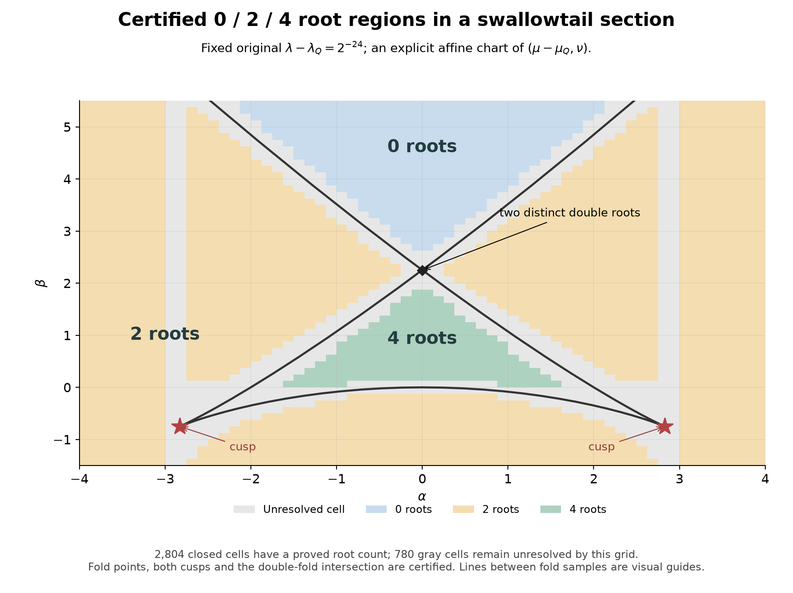

# R10 — Dörtlü kökün çevresinde sonlu 0/2/4 kök geometrisi

20 Eylül 2026. R09 sonunda açık kalan soruyu bu aşamada cevapladık:
**oluşturduğumuz dörtlü kökün çevresindeki kök düzenine özgün kontrol
koordinatlarında açık bir kutu verebiliyor muyuz?**

Evet. Bir ortak kutu, içindeki bütün çoklu kökleri kapsayan fold
yüzeyi, dörtlü kökte birleşen iki cusp kolu ve 0, 2, 4 kökü ayrı ayrı
gerçekleştiren açık parametre bölgeleri artık hesap destekli kanıta bağlı.
Bu sonuç R09'da değiştirdiğimiz pozitif çekirdeğe ait; çekirdeğin
genliği bu aşamada dörtlü kök değeri ε4'te sabit tutuluyor.

## 1. Açık kutu ve içerdiği bilgi

Q'nun tam koordinatlarına göre s=t−tQ, ℓ=λ−λQ, m=μ−μQ yazalım.
Doğrulanan ortak pencere:

\[
|s|\leq 2^{-7}=0.0078125,\qquad
|\ell|\leq2^{-17}\simeq7.6294\times10^{-6},
\]
\[
|m|,|\nu|\leq2^{-34}\simeq5.8208\times10^{-11}.
\]

Bu kutu özgün t,λ,μ,ν ölçülerinde. Her parametrede, t penceresinin
uçlarında fonksiyonun işareti sabit; kökler uçlardan girip çıkmıyor.
Uygun sabit çarpanla normalize edilen g'nin dördüncü türevi bütün
kutuda 22 ile 26 arasında. Böylece pencere içindeki köklerin toplam
çokluğu en fazla dört. Çoklu kök yüzeyinin dışında basit gerçek kök
sayısı yalnızca **0, 2 veya 4** olabiliyor.

Kök sayısı için tam bir ölçüt de var: bütün durağan noktaları sıraya
koyup fonksiyonun uçlarda ve bu noktalardaki işaret değişimlerini
sayıyoruz. Her iki durağan nokta arasında fonksiyon sıkı monoton
olduğu için bu işlem gerçek kök sayısını veriyor. Ölçüt, çoklu kök
olmayan dejenereli durağan noktaları da kapsıyor.

## 2. Tek tek örneklerin çevresinde açık bölgeler var

L=2⁻²⁴ alalım. Aşağıdaki üç merkezin her birinin çevresinde aynı
yarıçapları kullandık: λ için L/128, μ ve ν için L²/256.

| Özgün kontrol farklarının merkezi (ℓ,m,ν) | Açık kutunun tamamındaki kök sayısı |
|---|---:|
| (−L,0,0) | 0 |
| (−L,−L²,0) | 2 |
| (+L,0,0) | 4 |

Dolayısıyla sonuç yalnızca hassas seçilmiş üç noktaya bağlı değil.
Her birinin çevresinde sıfırdan büyük hacimli bir bölge var ve
bölgenin tamamında aynı sayıda basit gerçek kök bulunuyor.

Buradaki g, asıl integralin sabit ve sıfır olmayan bir çarpanla
normalize edilmiş hâli; kökleri ve katlılıkları aynı. Eğriler Taylor
kapsamalarının orta değerleriyle çiziliyor; kök işaretçileri daralma
sertifikalarına dayanıyor. Ortak t penceresi, çizimdeki yatay aralıktan
daha büyük; tam kök sayısı o ortak pencere için doğrulandı.

## 3. Fold yüzeyi, iki cusp kolu ve çift katlı iki kökün kesişmesi

Her (s,ℓ) için g=gt=0 denklemlerini μ,ν'de tek bir çözüm veren
ortak kutuyla çözdük. Böylece asıl kontrol kutusundaki **bütün çoklu
kökleri içeren** bir yüzey elde edildi. Bazı parametrelerde aynı
kontrol noktasının üzerinde iki farklı s bulunabiliyor; yüzeyin
kendiyle kesişmesi tam olarak böyle oluşuyor.

Üçlü kökler için g=gt=gtt=0 denklemlerini, s'yi sürücü alarak üç
kontrolde birlikte çözdük. Bir cusp eğrisi var; s<0 ve s>0 kolları
dörtlü kökte birleşiyor. Eğri boyunca üçüncü türev sıkı artıyor ve
sıfırdan yalnızca Q'da geçiyor. Bu nedenle yardımcı kutudaki başka
bir cusp'ın gizlice dörtlü veya daha yüksek köke dönmesi dışlandı.

ℓ=2⁻²⁴ kesitinde her iki cusp da asıl kutunun içinde. t−tQ değerleri
yaklaşık −0,000172644729 ve +0,000172622255. Aynı kesitte,
**tek bir (λ,μ,ν) seçiminde iki ayrı çift kök** de doğrulandı;
bunlar yaklaşık s=−0,00029903044 ve s=+0,00029898952'de.
İki farklı parametredeki fold noktalarını aynı olaymış gibi
birleştirmiyoruz. Dört denklem aynı anda çözülüyor.

İki cusp kolu ve kendiyle kesişme, standart swallowtail geometrisinin
özellikleri. [NIST DLMF §36.4](https://dlmf.nist.gov/36.4) bu standart
yapıyı tanımlıyor. Buradaki yeni hesap, bu özel integralde nerede ve
hangi sonlu sınırlar içinde gerçekleştiğini doğruluyor.

## 4. Kök sayısı haritasında kesin ve belirsiz alanlar

Bu çizim sabit ℓ=2⁻²⁴ kesitini gösteriyor. α,β eksenleri, özgün μ,ν
düzleminin açıkça kayıtlı bir doğrusal dönüşüm ve ölçeklemeyle
gösterimi. Bilinmeyen bir normal-biçim dönüşümü kullanılmıyor; her
hücrenin gerçek μ,ν karşılığı tam bir matrisle belirli.

- Mavi: hücrenin tamamında 0 basit gerçek kök.
- Sarı: hücrenin tamamında 2 basit gerçek kök.
- Yeşil: hücrenin tamamında 4 basit gerçek kök.
- Gri: bu ağ hesabının kesin kök sayısı atayamadığı hücreler.

64×56 hücrenin **2.804'ü** kanıta bağlı: 430 sıfır-kök, 2.184
iki-kök ve 190 dört-kök hücresi. **780 hücre açık bırakıldı.**
Bazıları fold sınırına yakın; bazılarında durağan noktaların sayısı
değişirken kullanılan kapsama yeterince dar kalmıyor. Gri hücrelerin
hepsi çoklu kök içeriyor demiyoruz. Aralarını renklendirerek ispat
varmış görüntüsü de oluşturmadık.

Bu ayrım, ortak kutunun sürekli teoremiyle çelişmiyor. Ortak teorem
çoklu kök yüzeyini, en fazla dört kökü ve tam işaret ölçütünü veriyor;
ağ hesabı bu ölçütü seçili hücreler üzerinde sayısal olarak sonuçlandırıyor.

## 5. Kontrol zinciri

R09'un integral verileri ve tam dörtlü kök kimliği kullanıldı. ν
değişimini de kapsayan **yeni** mutlak majorantlar hesaplandı; eski
ν=0 sınırları yeni üç boyutlu kutuya taşınmış sayılmadı. Yeni dört
değişkenli Taylor modelinde kalanlar açıkça kapsanıyor.

Ayrı rasyonel programlar:

- bütün ortak kutuyu, fold yüzeyini ve cusp eğrisini;
- üç açık 0/2/4 kök bölgesini;
- renkli 2.804 hücrenin tamamını;
- iki cusp, bir iki-çift-kök kesişmesi, 81 fold noktası ve altı
  basit kök için toplam 90 daralma kontrolünü

yeniden doğruladı. Bu denetçiler yeni Taylor ifadelerini de yeniden
kuruyor. Ek olarak 27 doğrudan rigoröz integral ve dokuz noktada
90/115 basamaklı ayrı mpmath hesabı uyuştu.

Güven sınırı açık: rasyonel denetçiler R09 integral kapsamalarını
ve yeni mutlak majorantları girdi kabul ediyor. Bunlar dış hakem
incelemesi veya biçimsel ispat asistanı doğrulaması değil.
İlk aralık-kuvveti uygulamasındaki yazılım sorunu bir sertifika
üretilmeden yakalandı; v2 düzeltmesi ve başarısız kayıt korunuyor.
[Tanılama notu](DIAGNOSTICS.md).

## 6. Makalede neyi taşıyabilir?

R09 aynı Q'yu korurken açıklığın tasarlanmasını ve dörtlü köke
ulaşılmasını vermişti. R10 bu dörtlü kökün çevresinde gerçek kök
sayısı geçişlerine açık bir sonlu geometri ekliyor. Böylece
"yerel olarak swallowtail tipinde" cümlesinin yanına **hangi
koordinat kutusunda, hangi kök düzenleri ve hangi hata sınırlarıyla**
gerçekleştiğini koyabiliyoruz.

Bu, hesap destekli bir makale için somut bir teorem zinciri.
Genel swallowtail geometrisinin yeni olduğunu söyleyemeyiz.
Özgün katkı adayı; pozitif integral ailesindeki momentle konum
koruma, açıklık tasarımı ve bu sonlu kök geometrisinin birleşimi.
Bunun literatürdeki önceliği ve hakemli yayın değeri dış değerlendirme
gerektiriyor. Fiziksel zaman, kararlılık veya deneysel bir sistem
tanımlamadığımız için fiziksel faz geçişi iddiası kurulmuyor.

Özgün sabit çekirdekte dörtlü kök, bütün parametre uzayındaki kök
sayısı ve bütün üç boyutlu kutunun tam sayısal renklendirilmesi
bu aşamanın sonucu değil. Makalenin asıl metni değiştirilmedi;
İngilizce teorem eki ve şekil açıklamaları ayrı hazırlandı.

[Ayrıntılı kanıt](PROOF.md) · [Yeniden üretim](README.md) ·
[Okunabilir sayısal kayıt](results/key_results.json) ·
[Çalışma defteri](../CALISMA_DEFTERI.md)
